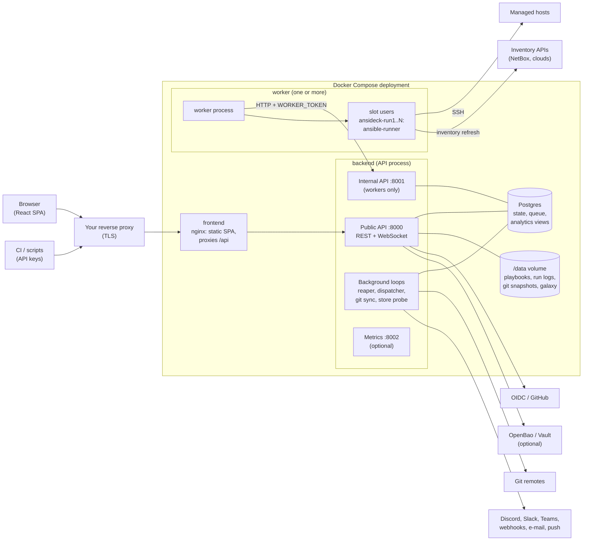

# Architecture

AnsiDeck is a web UI and API for running Ansible playbooks. This page describes its major components, how
they talk to each other, and the properties each one is responsible for. For what this means for security,
see [security.md](security.md) and the [assurance case](assurance-case.md).

## Components

| Component | Code | Responsibility |
| --- | --- | --- |
| **Frontend** | `frontend/` (React, TypeScript, Vite, Tailwind, Radix) | A single-page app served as static files by an unprivileged nginx, which also proxies `/api` (including WebSocket upgrades) to the backend. It holds no secrets; everything it shows comes from the public API. |
| **Public API** | `backend/app/main.py`, `backend/app/routers/` (FastAPI) | Authentication (password + TOTP, OIDC, GitHub, API keys), per-project role-based access control (`app/permissions.py`, `app/scoping.py`), CRUD for projects, credentials, inventories, playbooks, git sources, inventory sources, notifications, users and API keys; run triggering; live run output over WebSocket; audit log. |
| **Internal API** | `backend/app/internal_api.py` | A separate ASGI app on its own port (8001), never published or proxied. Workers use it to claim jobs, fetch a job's description and secrets, upload events and output, heartbeat and complete. Every call carries the shared `WORKER_TOKEN`, and calls about a claimed job also carry that claim's own token. |
| **Background loops** | `app/reaper.py`, `app/notifications/`, `app/git_sync.py`, `app/secret_store.py` | Run inside the API process. The reaper ends work nobody will finish (lost workers, timeouts, unconfirmed cancels), schedules inventory refreshes and prunes old data. The dispatcher delivers notifications with retries. The git loop polls git sources. The probe checks that the secret store is reachable. |
| **Postgres** | `app/models.py`, `backend/alembic/` | The single source of truth for state and the job queue. Jobs are rows claimed with `UPDATE … FOR UPDATE SKIP LOCKED` (`app/queue.py`); partial unique indexes enforce one running run per inventory. Schema changes go through Alembic migrations. An optional `analytics` schema holds read-only views for Grafana. |
| **Data volume** | `app/run_log.py`, `app/storage.py`, `app/galaxy.py` | Playbook files, run output (append-only JSONL, its length committed with the run's row), git mirrors and the snapshots runs pin, and Galaxy roles/collections (mounted read-only into workers). |
| **Workers** | `backend/app/worker/`, `app/run_worker.py`, `app/run_isolation.py` | Claim playbook runs and inventory refreshes over the internal API, then execute each in a slot: a child process running as that slot's own Linux user (`ansideck-run<n>`), with no capabilities, a private home, and its files and processes cleared after every job. Workers have no database access and no encryption key. A heartbeat thread renews leases and applies cancels and timeouts. |
| **Secret store** (optional) | `app/secret_store.py` | OpenBao or HashiCorp Vault (KV v2). Credentials and vault passwords can be references into a per-project subtree, read by the API when a job starts and handed only to the worker that claimed it. |
| **Metrics** (optional) | `app/metrics.py`, `app/metrics_api.py`, `grafana/` | Prometheus metrics on port 8002 (bearer token), plus provisioned Grafana dashboards reading the analytics views. |

## How a run flows

1. A user (or an API key) starts a run. The API checks the caller's role in the project, pins the
   inventory (static hosts plus the latest dynamic-inventory snapshot) and, for a synced playbook, the git
   commit, then inserts a `queued` run.
2. A worker slot claims the oldest claimable run. The API returns a job description with exactly that run's
   secrets: the SSH key, vault password and the inventory rendered for the run, with strings from inventory
   sources marked `!unsafe`.
3. The slot's child process (as the slot user) writes the job into its private directory, unpacks a git
   snapshot if there is one, and runs `ansible-playbook` through ansible-runner.
4. Events stream back to the internal API. The API scrubs known secret values, appends them to the run's
   log, and wakes WebSocket listeners (`app/notify.py`), which re-read the log and send new lines to
   browsers.
5. The worker completes the run. The API records the result, raises notifications, and the slot is swept:
   everything its user still runs is killed and its files are deleted.

Inventory refreshes follow the same path, with `ansible-inventory` in place of `ansible-playbook`; the
API validates and normalises the output before storing it as a snapshot.

## Key properties

- **One source of truth.** State lives in Postgres and the run logs; in-process wake-ups carry no data,
  so a missed one only delays a listener.
- **Workers are untrusted relative to the API.** They only reach the internal API, receive one job's
  secrets at a time, and a worker whose claim has ended gets `410 Gone`.
- **Third-party code runs only in workers.** Playbooks, roles, collections and inventory plugins never run
  in the API process. The API does run `git` against untrusted repositories, hardened as described in
  [security.md](security.md).
- **Fail closed.** Production mode refuses insecure defaults, a worker that can't isolate slots refuses to
  start, a failing inventory source fails the refresh, and an unreachable secret store fails the run with
  a reason instead of falling back.
- **Horizontal workers, single API.** Any number of workers can join; the API is a single replica today
  (WebSocket wake-ups are in-process).

## Technology

Backend: Python 3.12, FastAPI, SQLAlchemy 2, Alembic, psycopg 3, ansible-core with ansible-runner,
cryptography (Fernet), argon2-cffi, pyotp, prometheus-client; dependencies managed with `uv`
(`backend/pyproject.toml`, `backend/uv.lock`). Frontend: React 19, TypeScript, Vite, Tailwind CSS v4, Radix
primitives (`frontend/package.json`, `frontend/package-lock.json`). Deployment: Docker images built from
digest-pinned base images, Docker Compose, Postgres (the compose file uses Postgres 18).
